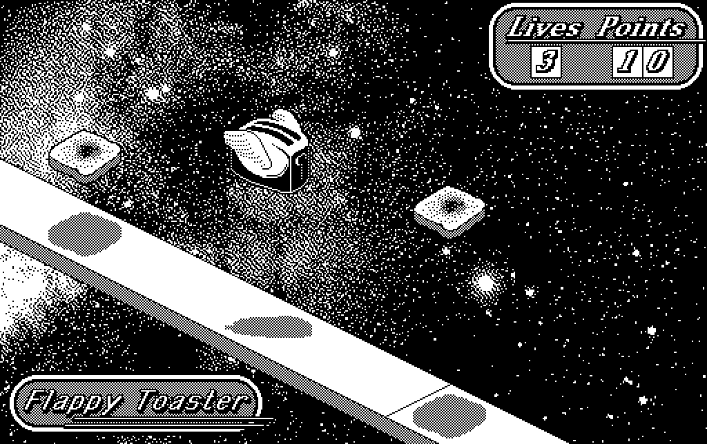

# 68K_Mac_GameShell
A small shell of an application that can be repurposed for creating 68K Macintosh sprite-based games.

### A note about the files

1) The 68K Macintosh used a <CR> (carriage return) to indicate the end of a line of text. Modern computing (and GitHub) prefer using the <LF> (line feed) character to indicate line breaks. To make the sources more readable in GitHub I have converted line endings to Unix's <LF>. If though you choose to pull down the sources and use them in a 68K project, you will want to covert the lines endings of the files to <CR>.

`mac2unix` and `unix2mac` are two command lines tools that do this conversion. To make the source files 68K Mac ready:

`find . -type f \( -name "*.c" -o -name "*.h" \) -exec unix2mac {} +`

To clean them back up for GitHub:

`find . -type f \( -name "*.c" -o -name "*.h" \) -exec mac2unix {} +`

2) Other files, the THINK C project files, resource files, paint files, are not plaintext—they have resource forks. These were compressed (zipped) on MacOS before uploading to this repo. You will have to uncompress them on the Mac to restore the resource fork before moving them to a 68K Mac (or emulator).
